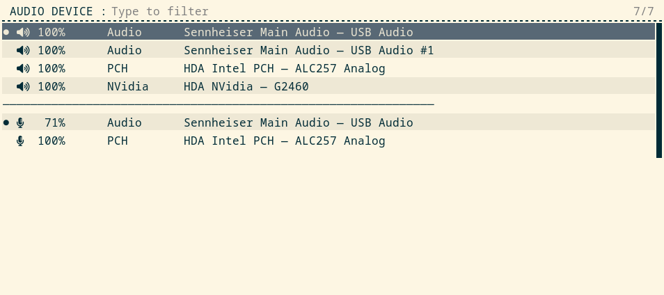

A device switcher for running ALSA on its own, with no sound server.

## Why?

PipeWire and PulseAudio exist for complex audio needs: sending individual applications to different devices, moving a playing stream from one device to another, Bluetooth audio, network audio, low-latency work with pro gear.

If you only ever use one sound device at a time and are happy with one global volume level (individual apps can still be configured to use different volume in their own settings), then running an audio server only adds unnecessary complexity and resource usage. You do not need PipeWire or PulseAudio running to get working sound, ALSA (kernel audio driver) on its own provides most of what you need.

## What it does

Plain ALSA cannot do "make this the default device now". The default is set in a config file `~/.asoundrc`, so switching device requires opening that file and editing it with the right card name and device number, in ALSA's own syntax.

alsa-switch provides a user-friendly `rofi` menu for writing that file for you:

- It lists the output and input devices that are currently connected.
- Marks which device is in use on each side, and shows its current level.
- When you pick one - it becomes the system default.
- Output and input devices are chosen independently.

## What it is not

alsa-switch is not a mixer. It will not send individual applications to different devices, will not balance levels between them, and cannot move a stream that is already playing (running application must be restarted for a change to take effect). If you want any of that - use a sound server.

This script only picks which device is the default, nothing else. If you want to adjust a volume level of that default device - use `alsamixer`.

## Requirements

- alsa-utils
- rofi
- A Nerd Font, for the icons in the menu
